# 3-Tier Quotes Application on Amazon EKS

A Kubernetes implementation of a containerized three-tier Quotes application deployed on Amazon Elastic Kubernetes Service (Amazon EKS). This project implements container orchestration, persistent storage, ingress routing, configuration management, and cloud-native deployment using Docker, Amazon ECR, Amazon EKS, and Kubernetes.

---

## Architecture Overview

The application architecture consists of three containerized tiers:

- **Frontend (Presentation Tier):** A Flask web UI for user interaction.
- **Backend (Application Tier):** A Flask REST API to handle business logic.
- **Database (Data Tier):** MySQL 8.0 for persistent data storage.

Each tier is containerized with Docker, stored in Amazon Elastic Container Registry (ECR), and orchestrated on a managed Kubernetes cluster (EKS).

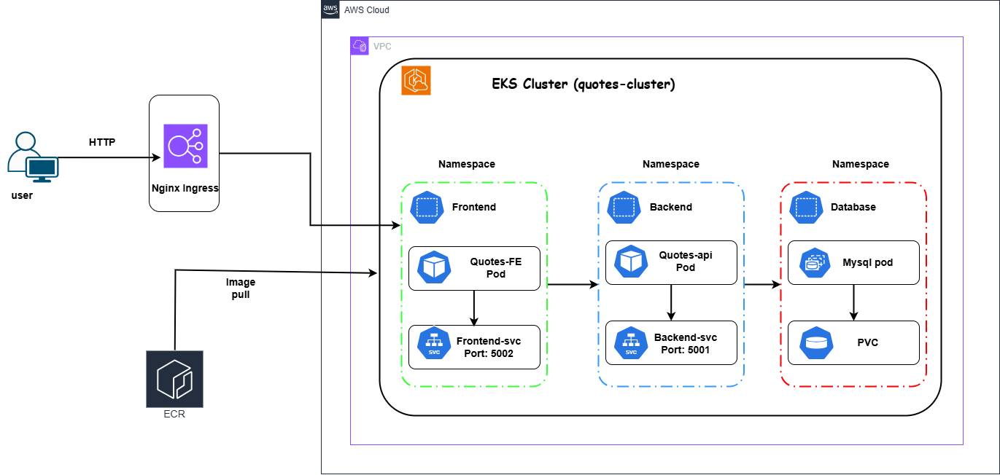

---

## Prerequisites

Ensure the following tools are installed and configured on your local machine before proceeding.

| Tool | Purpose |
|------|---------|
| **AWS CLI** | Interact with AWS services |
| **kubectl** | Manage Kubernetes resources |
| **eksctl** | Create and manage EKS clusters |
| **Docker** | Build and manage container images |
| **Helm** | Deploy Kubernetes applications |

### Verification

Run the following command to confirm all tools are installed correctly:

```bash
aws --version && kubectl version --client && eksctl version && docker --version && helm version --short
```

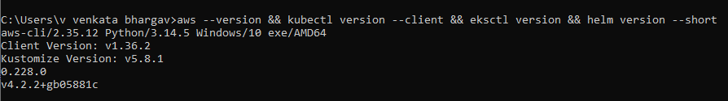

---

## Part 1: Storing Application Images (Amazon ECR)

Implemented Amazon ECR as the private container registry for storing and managing Docker images.

### Step 1.1: Create ECR Repositories

Create a dedicated repository for each application tier.

```bash
aws ecr create-repository --repository repositories-name quotes-db --region ap-south-1
aws ecr create-repository --repository-name quotes-api --region ap-south-1
aws ecr create-repository --repository-name quotes-frontend --region ap-south-1
```

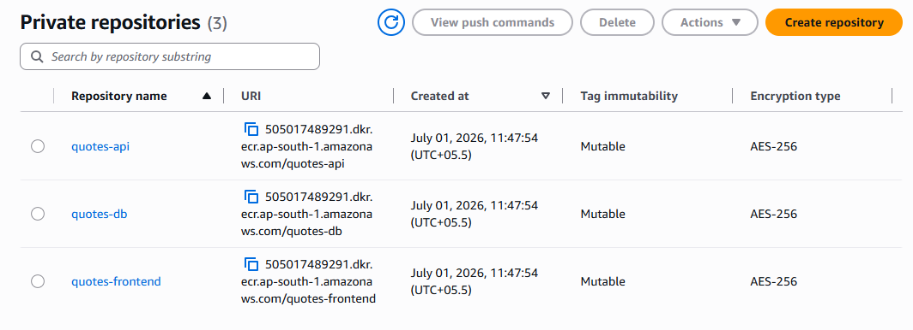

### Step 1.2: Build and Push Docker Images

Authenticate Docker to your ECR registry, then build and push the images for each tier.

```bash
# 1. Authenticate Docker to ECR
aws ecr get-login-password --region ap-south-1 | docker login --username AWS --password-stdin 505017489291.dkr.ecr.ap-south-1.amazonaws.com

# 2. Build images locally
docker build -t quotes-db ./db
docker build -t quotes-api ./api
docker build -t quotes-frontend ./app

# 3. Tag images for ECR
docker tag quotes-db:latest 505017489291.dkr.ecr.ap-south-1.amazonaws.com/quotes-db:latest
docker tag quotes-api:latest 505017489291.dkr.ecr.ap-south-1.amazonaws.com/quotes-api:latest
docker tag quotes-frontend:latest 505017489291.dkr.ecr.ap-south-1.amazonaws.com/quotes-frontend:latest

# 4. Push images to ECR
docker push 505017489291.dkr.ecr.ap-south-1.amazonaws.com/quotes-db:latest
docker push 505017489291.dkr.ecr.ap-south-1.amazonaws.com/quotes-api:latest
docker push 505017489291.dkr.ecr.ap-south-1.amazonaws.com/quotes-frontend:latest
```

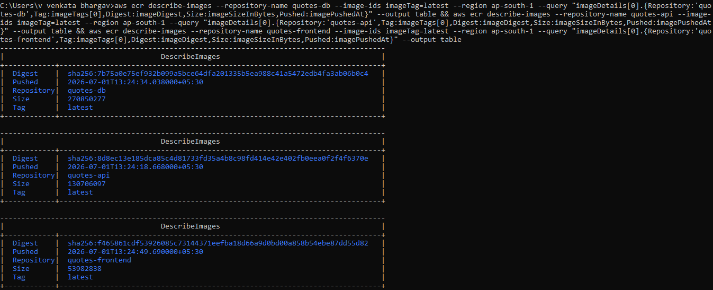

Once completed, the application images are securely stored in Amazon ECR and are ready to be deployed to the EKS cluster.

---

## Part 2: Creating the Kubernetes Cluster (Amazon EKS)

Implemented a managed Amazon EKS cluster to host the Kubernetes workloads.

### Step 2.1: Create an EKS Cluster

Use `eksctl` to provision a managed EKS cluster with a single node. This process takes approximately 10-15 minutes.

```bash
eksctl create cluster \
  --name quotes-cluster \
  --region ap-south-1 \
  --nodegroup-name standard-workers \
  --node-type c7i-flex.large \
  --nodes 1 \
  --managed
```

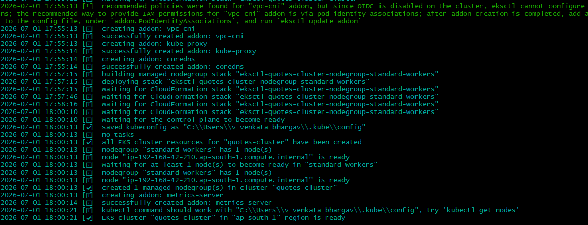

After the cluster is created, verify its status and inspect the nodes.

```bash
kubectl cluster-info
kubectl get nodes -o wide
```

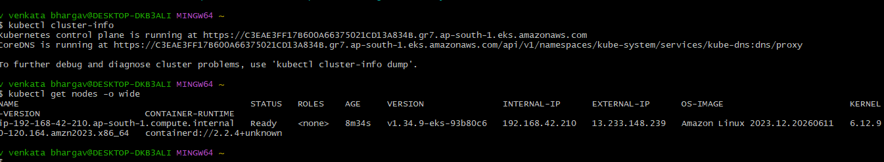

The cluster is now active and ready to host the application workloads.

---

## Part 3: Preparing the Cluster

Configured the Kubernetes cluster by creating namespaces, Secrets, and ConfigMaps required for the application deployment.

### Step 3.1: Create Namespaces

Namespaces provide logical isolation for application components. Create a dedicated namespace for each tier.

```bash
kubectl apply -f k8s-manifest/ns.yaml
```

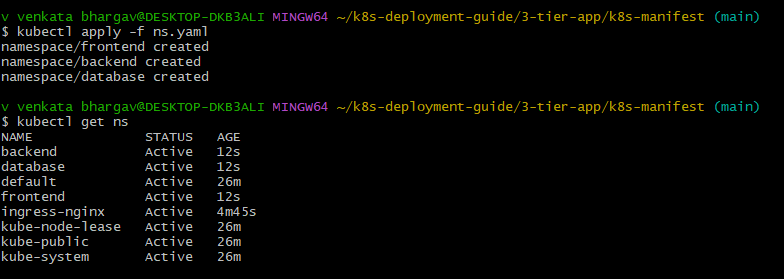

### Step 3.2: Store Database Credentials (Secret)

Create a Kubernetes Secret to securely store sensitive database credentials, such as passwords.

```bash
kubectl apply -f k8s-manifest/secrets.yaml
```

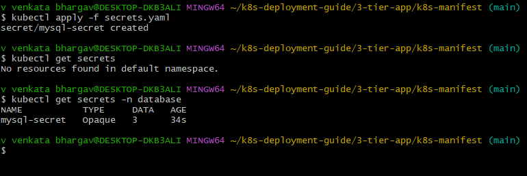

### Step 3.3: Store Database Configuration (ConfigMap)

Create a Kubernetes ConfigMap to store non-sensitive configuration data, such as the database host, port, and name.

```bash
kubectl apply -f k8s-manifest/config.yaml
```

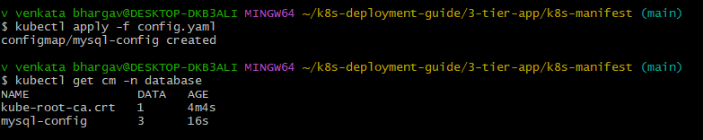

---

## Part 4: Deploying the Database Tier (MySQL)

Implemented MySQL using a Kubernetes StatefulSet with a PersistentVolumeClaim (PVC) to ensure persistent storage and stable pod identity.

```bash
kubectl apply -f k8s-manifest/mysql.yaml
```

Monitor the pod status until it is in the `Running` state.

```bash
kubectl get pods -n database -w
```

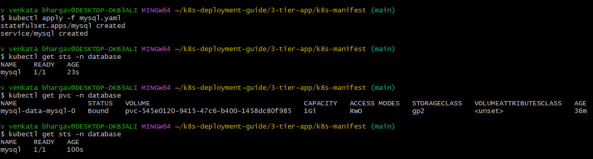

---

## Part 5: Deploying the Backend Tier (API)

The backend is a stateless Python Flask application. Deploy it using a Kubernetes **Deployment**, which is suitable for stateless services that can be scaled horizontally.

```bash
kubectl apply -f k8s-manifest/quotes-api.yaml
```

Verify that the API pods are running successfully.

```bash
kubectl get pods -n backend
```

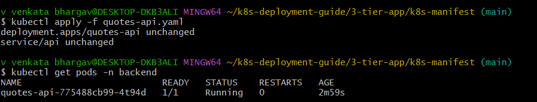

### Verify API Connectivity

To confirm that the API and database are communicating correctly, execute a test request from within the cluster.

```bash
kubectl run test-pod --image=curlimages/curl -it --rm --restart=Never -- curl -s http://api.backend.svc.cluster.local:5001/api/quotes
```

A successful response will contain a JSON list of quotes.

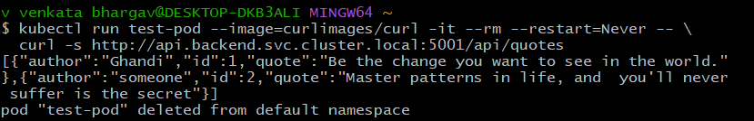

---

## Part 6: Deploying the Frontend Tier

The frontend is a second Flask application responsible for serving the user interface. It communicates with the backend API to fetch and display data.

```bash
kubectl apply -f k8s-manifest/quotes-frontend.yaml
```

Verify the frontend pod status.

```bash
kubectl get pods -n frontend
```

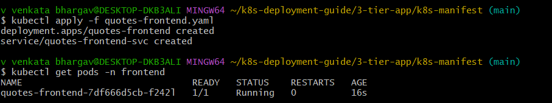

---

## Part 7: Exposing the Application (Ingress)

To make the application accessible from the internet, an **Ingress** resource is required to route external HTTP traffic to the frontend service.

### Step 7.1: Install the Ingress Controller

Install the ingress-nginx controller using Helm to manage incoming traffic.

```bash
helm repo add ingress-nginx https://kubernetes.github.io/ingress-nginx
helm repo update
helm install ingress-nginx ingress-nginx/ingress-nginx \
  --namespace ingress-nginx --create-namespace
```

Wait for the LoadBalancer to be assigned an external IP address.

```bash
kubectl get svc -n ingress-nginx
```

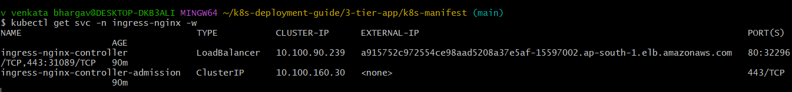

### Step 7.2: Create the Ingress Resource

Define an Ingress rule to route traffic directed at the root path (`/`) to the frontend service.

```bash
kubectl apply -f k8s-manifest/ingress.yaml
```

Verify that the Ingress resource is active.

```bash
kubectl get ingress -n frontend
```

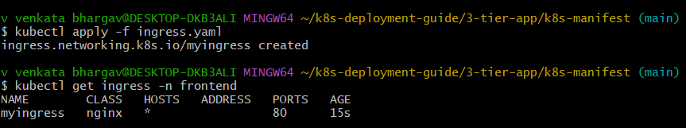

---

## Part 8: Verifying the Deployment

### Step 8.1: Check All Resources

Confirm that all pods and services are deployed and running across all namespaces.

```bash
kubectl get pods -A
kubectl get svc -A
```

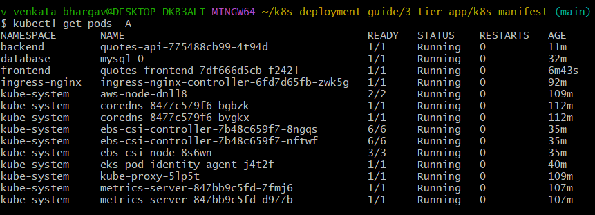
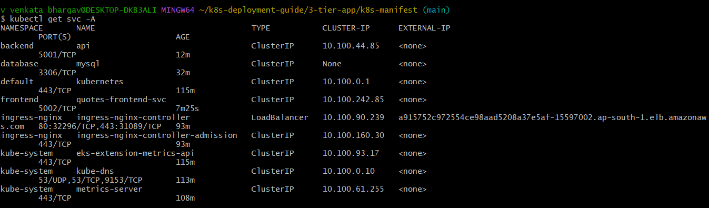

### Step 8.2: Access the Application

Retrieve the external hostname or IP address of the Ingress controller.

```bash
kubectl get svc -n ingress-nginx ingress-nginx-controller -o jsonpath='{.status.loadBalancer.ingress[0].hostname}'
```

Open the returned address in a web browser to access the Quotes application.

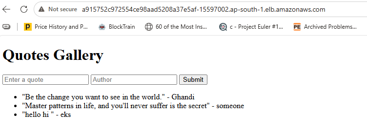

The application is now live. Data submitted through the frontend will be persisted in the MySQL database.

---

## Kubernetes Manifest Reference

The following table summarizes the purpose of each Kubernetes manifest used in this deployment.

| File | Resource | Namespace | Purpose |
|------|----------|-----------|---------|
| `ns.yaml` | Namespace (x3) | --- | Logical isolation for each tier |
| `secrets.yaml` | Secret | `database` | Secures database credentials |
| `config.yaml` | ConfigMap | `database` | Stores database connection parameters |
| `mysql.yaml` | StatefulSet, Service | `database` | Manages MySQL with persistent storage |
| `quotes-api.yaml` | Deployment, Service | `backend` | Runs the Flask API |
| `quotes-frontend.yaml` | Deployment, Service | `frontend` | Runs the Flask UI |
| `ingress.yaml` | Ingress | `frontend` | Routes external traffic to the frontend |

---

## Cleanup

To avoid incurring unnecessary AWS charges, delete all resources after testing.

### Remove Application Resources

Delete all Kubernetes resources defined in the `k8s-manifest/` directory.

```bash
kubectl delete -f k8s-manifest/
```

### Delete the EKS Cluster

Delete the entire EKS cluster and its associated resources.

```bash
eksctl delete cluster --name quotes-cluster --region ap-south-1
```

### Delete ECR Repositories

Remove the stored Docker images from Amazon ECR.

```bash
aws ecr delete-repository --repository-name quotes-db --force
aws ecr delete-repository --repository-name quotes-api --force
aws ecr delete-repository --repository-name quotes-frontend --force
```

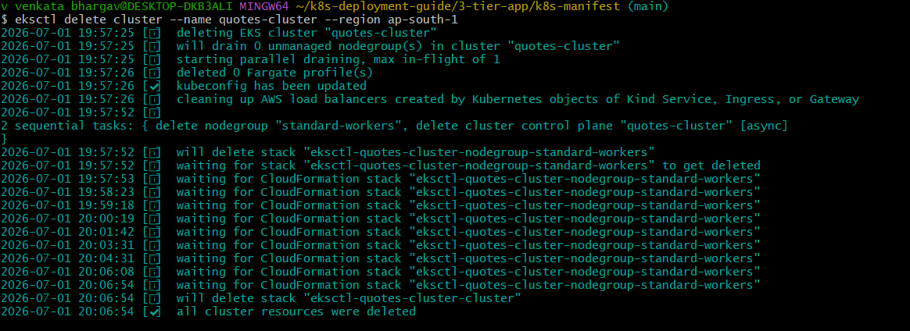

---

## Technology Stack

| Technology | Role |
|------------|------|
| **Docker** | Containerization of application components |
| **Amazon ECR** | Private container image registry |
| **Amazon EKS** | Managed Kubernetes orchestration |
| **Kubernetes** | Container orchestration and management |
| **Helm** | Package manager for Kubernetes |
| **MySQL** | Relational database management system |
| **Flask** | Python web framework for the frontend and API |

---

## Data Flow Summary

1. A user sends a request to the **Ingress LoadBalancer** via a web browser.
2. The **Ingress** routes the request to the **Frontend** service.
3. The **Frontend** sends a request to the **Backend API**.
4. The **Backend API** queries the **MySQL Database** to retrieve or persist data.
5. All services run within **Amazon EKS**, pulling container images from **Amazon ECR**.

---

## Issues & Troubleshooting

The following issues were encountered during the deployment of this application. The solutions and investigation steps are documented below for reference.

### Issue 1: EBS CSI Driver Deployment Failure

During the provisioning of the EKS cluster, the `aws-ebs-csi-driver` add-on failed to install correctly. This prevented the MySQL StatefulSet from provisioning its persistent storage.

**Symptoms:**
- The EBS CSI driver add-on status remained in `CREATING` indefinitely.
- MySQL pods were stuck in the `Pending` state with PVCs unbound.

**Investigation:**
1. Checked the AWS add-on status using `aws eks describe-addon`.
2. Verified that the `eks-pod-identity-agent` was missing, which is a prerequisite for the EBS CSI driver.
3. Inspected the controller pod logs which showed `AccessDenied` errors due to missing IAM permissions.

**Resolution:**
1. Deleted the broken EBS CSI driver add-on.
2. Installed the `eks-pod-identity-agent` add-on.
3. Re-installed the `aws-ebs-csi-driver` add-on with the correct pod identity association.

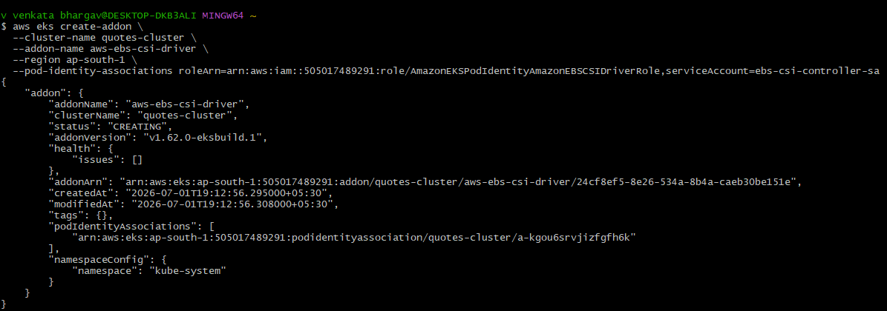

**Result:** The CSI driver was correctly installed, allowing the PVC to be dynamically provisioned and bound to the MySQL pod.

### Issue 2: CreateContainerConfigError - ConfigMap Not Found

After deploying the backend API, the pods failed to start and entered a `CreateContainerConfigError` state.

**Symptoms:**
- Backend API pods showed `CreateContainerConfigError`.
- The pod events indicated: `Error: configmap "mysql-config" not found`.

**Investigation:**
1. Verified that the `mysql-config` ConfigMap existed in the cluster.
2. Checked the namespace of both the pod (`backend`) and the ConfigMap (`database`).
3. Discovered that ConfigMaps are namespace-scoped resources. A pod can only access ConfigMaps within its own namespace.

**Resolution:**
1. Created a new ConfigMap named `mysql-config` within the `backend` namespace.
2. Restarted the backend deployment so the pods could successfully mount the configuration.

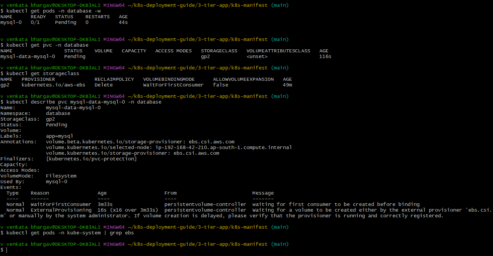

**Result:** The backend pods started successfully and were able to read the database connection parameters from the ConfigMap.

For a more detailed, step-by-step runbook of these debugging processes, please refer to the files in the `issues/` directory.

---

## Author

**Gorantla Sai Ram**<br>
DevOps Engineer | Kubernetes Practitioner<br><br>

**GitHub:** https://github.com/Sairam415/<br>
**LinkedIn:** https://www.linkedin.com/in/sairamgorantla/
